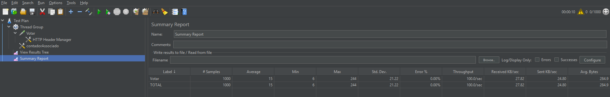

# API de Votação

---
## Descrição
Aplicação back-end para gerenciamento de sessões de votação em pautas.

A aplicação permite:
- Cadastro de pautas
- Abertura de sessões de votação com tempo determinado
- Registro de votos (Sim / Não)
- Apuração do resultado da votação

---
## Decisões de Projeto e Arquitetura

- **Tecnologias**: Utilizado **Spring Boot 3 + Java 17**.
- **Arquitetura**: Camadas bem definidas (Controller, Service, Repository) com foco em **Clean Code**.
- **Arquitetura Orientada a Eventos**: O registro de votos e a notificação de resultados são feitos de forma assíncrona via RabbitMQ, garantindo que picos de tráfego não afetem a disponibilidade da API.
- **Alta Disponibilidade (Redis)**: Utilizado para controle de idempotência e validação rápida de sessões de votação, reduzindo o I/O no banco de dados principal.
- **Automação (Scheduler)**: Implementado SessaoScheduler para monitorar e encerrar sessões expiradas automaticamente, calculando o resultado e notificando via mensageria.
- **Persistência**: **PostgreSQL** com Spring Data JPA para armazenamento dos dados.
- **Regras de Negócio**:
  - **Voto Único**: Validação para garantir que cada associado vote apenas uma vez por pauta.
  - **Sessão Padrão**: Caso não seja informada uma duração, a sessão é aberta automaticamente por 1 minuto.
  - **Encerramento Automático**: O processamento e a divulgação do resultado ocorrem de forma automática após o fim da sessão.
- **Lombok Abstraído**: Opção por código explícito para facilitar a avaliação técnica e manter o projeto leve.
- **Observabilidade**: Inclusão do **Spring Actuator** para monitoramento de saúde do sistema, seguindo padrões de ambientes Cloud.

---
## Tarefas Bônus

No desenvolvimento deste projeto, foram contempladas as seguintes tarefas bônus:

- **Bônus 2 (Mensageria e Filas)**: Integração com **RabbitMQ** para o processamento assíncrono de votos e publicação dos resultados das pautas.
- **Bônus 3 (Performance)**: Implementação de camada de cache com **Redis** para validação de sessões e controle de duplicidade de votos.
- **Bônus 4 (Testes de Performance)**: Realização de testes de carga via **Apache JMeter**, garantindo suporte a alta concorrência.
> **Observação sobre o Bônus 1 (Integração com CPF)**: Esta funcionalidade não foi implementada conforme orientação da recrutadora, devido à indisponibilidade da URL externa de consulta no momento do desenvolvimento.

---
## Execução da aplicação
mvn spring-boot:run

### 1. Infraestrutura (Docker)
A aplicação depende do **PostgreSQL**, **RabbitMQ** e **Redis**. Certifique-se de ter o Docker instalado e execute o comando abaixo para subir os serviços:
```bash
docker-compose up -d
```

### 2. Rodar o Projeto
Com a infraestrutura ativa, inicie a aplicação via Maven:
```bash
mvn spring-boot:run
```

### 3. Testando a API (Collection)
- Arquivo: Localizado em docs/collections/votacao_api_collection.postman_collection.json
- Como usar: Importe o arquivo no Postman e execute os requests com os casos de testes.

### Informações Úteis
- URL Base: http://localhost:8080
- Health Check (Actuator): http://localhost:8080/actuator/health

---
## Relatório de Performance (Teste de Carga)

Foi realizado um teste de carga utilizando **Apache JMeter** para validar o comportamento do sistema sob concorrência.

>Arquivo do teste que foi realizado no JMeter está em docs/jmeter/jmeter-votar.jmx

### Cenário do Teste
- **Volume**: 1.000 requisições (votos).
- **Usuários Simultâneos**: 100 threads.
- **Ramp-up**: 10 segundos.
- **Payload**: Randomização de `associadoId` (UUID) e `voto` (Sim/Não) via funções Groovy.

### Resultados Obtidos
| Métrica | Resultado |
| :--- | :--- |
| **Amostras (Samples)** | 1.000 |
| **Tempo de Resposta Médio (Average)** | **14 ms** |
| **Vazão (Throughput)** | 100.0/sec |
| **Taxa de Erro** | 0.00% |

#### Screenshot do Relatório (JMeter Summary Report)

